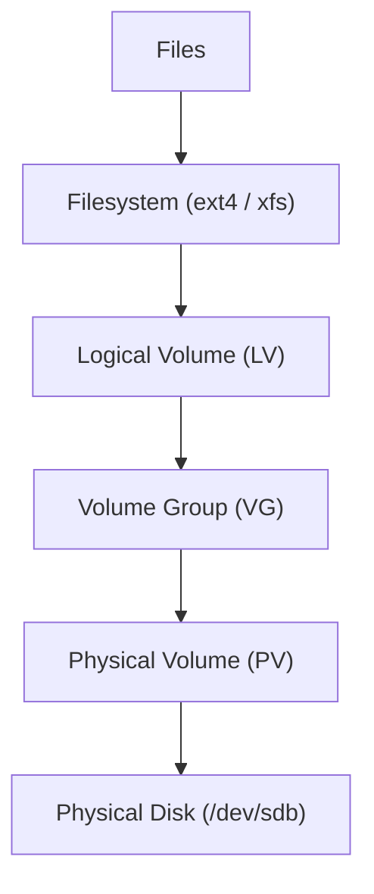

# LVM Engineering Handbook
**Project:** Atom-Bomb Storage Architecture
**Author:** Aniket Kumar
**Purpose:** Production-grade reference for creating, scaling, and troubleshooting Linux Logical Volume Manager (LVM) storage.
**Last Enriched:** PERRIO Learning Session (Stages 1–3)

---

## Table of Contents
1. [What is LVM?](#1-what-is-lvm)
2. [Storage Hierarchy](#2-storage-hierarchy)
3. [Operational Flow](#3-operational-flow)
4. [Storage Container Model](#4-storage-container-model)
5. [Mental Models & Analogies](#5-mental-models--analogies)
6. [Step-by-Step Implementation](#6-step-by-step-implementation)
7. [Persistent Mount](#7-persistent-mount)
8. [Expanding Storage](#8-expanding-storage)
9. [Adding Additional Disks](#9-adding-additional-disks)
10. [LVM Snapshots](#10-lvm-snapshots)
11. [LVM Internals](#11-lvm-internals)
12. [LVM Metadata](#12-lvm-metadata)
13. [IO Path](#13-io-path)
14. [Common Observations](#14-common-observations)
15. [Troubleshooting Commands](#15-troubleshooting-commands)
16. [Recovery Scenario](#16-recovery-scenario)
17. [Engineer Cheat Sheet](#17-engineer-cheat-sheet)
18. [XFS-Specific Troubleshooting](#18-xfs-specific-troubleshooting)

---

## 1. What is LVM?

**Logical Volume Manager (LVM)** is a storage virtualization layer in Linux that allows flexible disk management.

Instead of binding filesystems directly to disks, LVM introduces a logical abstraction layer that enables:
- **Dynamic storage expansion**: Resize volumes on the fly.
- **Disk pooling**: Aggregate multiple disks into a single large pool.
- **Snapshot backups**: Create point-in-time copies of data.
- **Multi-disk aggregation**: Stripe or mirror data across multiple physical drives.

### 🏠 The Apartment Analogy
> Raw disks on Linux are like three storage rooms in an apartment — all different sizes, awkwardly shaped, impossible to reorganize.
> **LVM is like hiring a storage architect** who knocks down the walls, combines those rooms into one open-plan space, and lets you draw your own partitions — **in pencil, not concrete**. You can erase and redraw them anytime, without moving out.

---

## 2. Storage Hierarchy

LVM works as a layered storage stack, moving from physical hardware to logical files.



### Hierarchy in Plain English
```
Physical Disks:    [PD1]   [PD2]   [PD3]
                     ↓       ↓       ↓
Physical Volumes:  [PV1]  [PV2]  [PV3]   ← LVM labels the disks
                     └───────┴───────┘
Volume Group:            [VG]            ← One big pooled space
                        ↙    ↘
Logical Volumes:      [LV1]  [LV2]       ← Virtual partitions you carve
                        ↓      ↓
Filesystems:         [ext4] [xfs]        ← Formatted ON TOP of LV
                        ↓      ↓
Mount Points:      /mnt/data  /mnt/logs  ← Where apps read/write files
```

> ⚠️ **Common mistake:** The filesystem is NOT inside the LV — it is formatted *onto* the LV. Think of an LV as a plot of land and the filesystem as the house built on it. The house sits on the plot; it doesn't contain it.

---

## 3. Operational Flow

Typical workflow when adding new storage to a system:

1. **Add Disk**
2. **Identify Disk** (`lsblk`)
3. **Create Physical Volume** (`pvcreate`)
4. **Create Volume Group** (`vgcreate`)
5. **Create Logical Volume** (`lvcreate`)
6. **Create Filesystem** (`mkfs`)
7. **Mount Filesystem** (`mount`)
8. **Persist Mount** (edit `/etc/fstab`)

---

## 4. Storage Container Model (Venn Concept)

```text
+----------------------------------------------------+
|                    Volume Group (VG)               |
|                                                    |
|   +--------------------------------------------+   |
|   |              Logical Volume (LV)           |   |
|   |                                            |   |
|   |   +------------------------------------+   |   |
|   |   |            Filesystem              |   |   |
|   |   |            (ext4/xfs)              |   |   |
|   |   |                                    |   |   |
|   |   |               FILES                |   |   |
|   |   |                                    |   |   |
|   |   +------------------------------------+   |   |
|   |                                            |   |
|   +--------------------------------------------+   |
|                                                    |
|  PV1 (/dev/sdb)      PV2 (/dev/sdc)                |
|                                                    |
+----------------------------------------------------+
```

> **Think of it like:** Disk → Storage Pool → Virtual Partition → Filesystem → Files

---

## 5. Mental Models & Analogies

*This section was built during PERRIO learning sessions to capture intuitive understanding.*

### 🏙️ The Township Analogy (Extents)
- **PV** = raw land you bought
- **VG** = the township created by pooling all land parcels
- **LV** = individual plots carved from the township
- **Filesystem** = the house built on a plot
- **PE/LE (Extents)** = 4MB tiles on the warehouse floor; LVM works with tiles, not individual bytes

### 🗺️ The Mapping Table (Why LVM looks contiguous)
LVM maintains a spreadsheet-like mapping table internally:

```
LV "molecules" mapping table:
┌─────┬──────────────┬──────┐
│ LE  │ Physical Disk│  PE  │
├─────┼──────────────┼──────┤
│  0  │ /dev/sdb     │   0  │
│  1  │ /dev/sdb     │   1  │
│  2  │ /dev/sdc     │  50  │  ← jumps to different disk freely
│  3  │ /dev/sdd     │ 120  │
└─────┴──────────────┴──────┘
```
The LV looks contiguous to the filesystem. Physically, the blocks are spread across disks. The mapping table handles all translation transparently.

> 🎯 **Interview trap:** "Is an LV always contiguous on disk?" → **NO.** Logically yes, physically fragmented. The mapping table is why this works.

### ❄️ XFS Shrink — Why it's impossible
```
XFS Volume (10GB):
[AG0 header][data...][AG1 header][data...][AG2 header][data...]
     ↑                    ↑                    ↑
  fixed offset         fixed offset         fixed offset

If you shrink to 6GB → AG2 header location is GONE → filesystem corrupted
```
XFS writes Allocation Group metadata at **fixed offsets**. Shrinking destroys those headers. Unlike ext4, these cannot be relocated.

### 📸 Snapshot — Freeze vs Full Copy
```
Before snapshot:  LV → [Block A][Block B][Block C]

After snapshot + Block B modified:
Original LV  → [Block A][Block B_new][Block C]
Snapshot     → [Block B_old]   ← only the changed block is stored
```
A snapshot is **not a full copy**. It's a change journal. Space efficient — only divergence from original is stored.

---

## 6. Step-by-Step Implementation

### Step 1: Identify Disks
```bash
sudo lsblk
```

**Example output:**
```text
NAME    MAJ:MIN RM SIZE RO TYPE MOUNTPOINT
sda       8:0    0  20G  0 disk
├─sda1    8:1    0 19.9G 0 part /
sdb       8:16   0  10G  0 disk
```

| Device | Meaning |
| :--- | :--- |
| `sda` | OS disk |
| `sda1` | Root filesystem |
| `sdb` | New disk for LVM |

### Step 2: Create Physical Volume
```bash
sudo pvcreate /dev/sdb
```

**Verify:**
```bash
sudo pvs
```

### Step 3: Create Volume Group
```bash
sudo vgcreate atom-bomb /dev/sdb
```

**Verify:**
```bash
sudo vgs
```

### Step 4: Create Logical Volume
```bash
sudo lvcreate -L 5G -n molecules atom-bomb
```

**Verify:**
```bash
sudo lvs
```

**Device Paths:**
- `/dev/atom-bomb/molecules`
- `/dev/mapper/atom--bomb-molecules`

### Step 5: Create Filesystem
```bash
sudo mkfs.ext4 /dev/atom-bomb/molecules
```

### Step 6: Mount Filesystem
```bash
sudo mkdir -p /mnt/physics_lab
sudo mount /dev/atom-bomb/molecules /mnt/physics_lab
```

**Verify:**
```bash
df -h
```

---

## 7. Persistent Mount

### Find UUID
```bash
sudo blkid /dev/atom-bomb/molecules
```

### Edit fstab
```bash
sudo nano /etc/fstab
```
Add:
```text
UUID=7fad0a5a-f28b-4583-8f99-d9e9d1f43ab1  /mnt/physics_lab  ext4  defaults  0 2
```

### Validate
```bash
sudo mount -a
```

---

## 8. Expanding Storage

### Filesystem Resizing Quick Reference

| Filesystem | Auto Tool (`-r` flag) | Manual Tool | Manual Target | Online? | Shrinkable? |
| :--- | :--- | :--- | :--- | :--- | :--- |
| **ext4** | `resize2fs` | `resize2fs` | Device Path (`/dev/...`) | Yes | Yes (Offline) |
| **XFS** | `xfs_growfs` | `xfs_growfs` | **Mount Point** (`/mnt/...`) | Yes | **NO** |

> ⚠️ **Critical distinction:** `xfs_growfs` takes the **mount point**. `resize2fs` takes the **device path**. Mixing these up is one of the most common SRE errors.

### Scenario A: Expanding a Separate Data LV

**Recommended (auto-resize):**
```bash
sudo lvextend -r -l +100%FREE /dev/atom-bomb/molecules
```

**Manual (ext4):**
```bash
sudo lvextend -L +5G /dev/atom-bomb/molecules
sudo resize2fs /dev/atom-bomb/molecules
df -h /mnt/physics_lab
```

**Manual (XFS):**
```bash
sudo lvextend -L +5G /dev/atom-bomb/molecules
sudo xfs_growfs /mnt/physics_lab           # mount point!
df -h /mnt/physics_lab
```

### Scenario B: Expanding the Root Filesystem (`/`)

**Steps (XFS root — RHEL 9 default):**
```bash
sudo lvextend -r -L +10G /dev/rhel/root
# or manual:
sudo lvextend -L +10G /dev/rhel/root
sudo xfs_growfs /                          # root mount point
df -h /
```

**Steps (ext4 root):**
```bash
sudo lvextend -L +10G /dev/rhel/root
sudo resize2fs /dev/rhel/root
df -h /
```

---

## 9. Adding Additional Disks

```bash
sudo pvcreate /dev/sdc
sudo vgextend atom-bomb /dev/sdc
```

---

## 10. LVM Snapshots

### How Copy-on-Write Works
```
Before snapshot:
LV "molecules" → [Block A][Block B][Block C]

After snapshot created:
LV "molecules"      → [Block A][Block B][Block C]  (original, still live)
LV "molecules-snap" → [empty CoW store]             (only 1GB reserved)

When Block B is modified on original:
1. Old Block B COPIED to snap store FIRST
2. New Block B written to original LV
3. Snap still shows old Block B → point-in-time preserved
```

### Create Snapshot
```bash
sudo lvcreate -L 1G -s -n molecules-snap /dev/atom-bomb/molecules
```

### Mount Snapshot
```bash
sudo mkdir /mnt/snapshot
sudo mount /dev/atom-bomb/molecules-snap /mnt/snapshot
```

> 🏭 **Production use:** Take snapshot before risky DB migration. On failure, merge snapshot to rollback in seconds.

---

## 11. LVM Internals: Extents

LVM divides disks into chunks called **Extents**.

- **Physical Extent (PE)**: Storage chunk inside a physical volume.
- **Logical Extent (LE)**: Storage chunk assigned to logical volumes.
- **Default Size**: 4MB (configurable during VG creation).
- **Mapping direction**: Always LE → PE (logical to physical). Never reversed.

**Mapping Example:**
```
LV molecules LE0 → /dev/sdb PE0
LV molecules LE1 → /dev/sdb PE1
LV molecules LE2 → /dev/sdc PE50   ← spans to second disk
```

**How LV size is calculated:**
```
lvcreate -L 5G  →  5120MB ÷ 4MB = 1280 extents claimed from VG pool
```

---

## 12. LVM Metadata

### On-Disk Metadata
Stored in the PV header. Inspect with:
```bash
sudo pvdisplay -m
```

### Backup Metadata
```bash
sudo vgcfgbackup
```

### In-Kernel (Device Mapper)
```bash
sudo dmsetup ls
sudo dmsetup table    # shows actual LE→PE extent mapping
```

---

## 13. IO Path

**Application Level:**
```text
write() → VFS → Filesystem (ext4/xfs) → Block Layer → Device Mapper (LE→PE) → Disk Driver → Physical Sectors
```

**Kernel Path detail:**
1. `write()` syscall
2. **VFS** (Virtual File System) — kernel abstraction
3. **Filesystem** (ext4/xfs) — converts file write to block addresses
4. **Block Layer** — handles queuing and scheduling
5. **Device Mapper** — translates LE (logical) → PE (physical) using mapping table
6. **Physical Disk Driver** — writes to actual sectors

> 🎯 **Interview answer to "what happens between write() and disk?"** — walk through these 6 steps.

---

## 14. Common Observations

### Double Dash in Device Names
Device Mapper escapes single dashes with double dashes to avoid naming ambiguity.
- Volume: `atom-bomb` → Mapper node: `atom--bomb`

### Capacity Discrepancy (5GB → 4.9GB)
Due to:
- Filesystem overhead
- Journaling requirements
- Binary (GiB) vs. Decimal (GB) unit differences

### CRITICAL: XFS Shrinking
Unlike ext4, **XFS filesystems cannot be shrunk.**
- **Root cause:** AG (Allocation Group) metadata headers are at fixed offsets
- **Action:** Always grow XFS in small increments
- **Recovery if over-allocated:**
  1. Backup all data from LV
  2. Unmount: `umount /mnt/physics_lab`
  3. Destroy LV: `sudo lvremove /dev/atom-bomb/molecules`
  4. Recreate smaller: `sudo lvcreate -L 3G -n molecules atom-bomb`
  5. Reformat: `sudo mkfs.xfs /dev/atom-bomb/molecules`
  6. Restore data

### LVM Linear Mode ≠ Fault Tolerant
Default LVM mode is **linear** — data is written sequentially across PVs.
- If PV1 fails → all blocks stored on PV1 are **permanently lost**
- No automatic redundancy
- For redundancy: use **LVM mirroring** or underlying **RAID**

---

## 15. Troubleshooting Commands

| Command | Description |
| :--- | :--- |
| `sudo pvs` / `pvdisplay` | Check Physical Volumes |
| `sudo vgs` / `vgdisplay` | Check Volume Groups |
| `sudo lvs` / `lvdisplay` | Check Logical Volumes |
| `lsblk -f` | View filesystems and UUIDs |
| `sudo dmsetup ls` | List Device Mapper entries |
| `sudo dmsetup table` | Show LE→PE mapping table |

---

## 16. Recovery Scenario

If volumes are not active (e.g., after a disk migration):
```bash
sudo vgscan
sudo vgchange -ay
sudo lvscan
```

---

## 17. Engineer Cheat Sheet

```bash
# Workflow Summary
sudo lsblk                                          # 1. Identify
sudo pvcreate /dev/sdb                              # 2. PV
sudo vgcreate atom-bomb /dev/sdb                    # 3. VG
sudo lvcreate -L 5G -n molecules atom-bomb          # 4. LV
sudo mkfs.xfs /dev/atom-bomb/molecules              # 5. Format (XFS recommended)
sudo mkdir -p /mnt/physics_lab                      # 6. Mount Prep
sudo mount /dev/atom-bomb/molecules /mnt/lab        # 7. Mount
sudo blkid                                          # 8. Get UUID

# Expansion Shortcut
sudo lvextend -r -L +10G /dev/atom-bomb/molecules   # Extend LV + Filesystem (auto)
sudo lvextend -l +100%FREE /dev/atom-bomb/molecules # Extend LV — claim ALL free space (safer in incidents)
sudo xfs_growfs /mnt/physics_lab                    # Manual XFS grow (data LV) — mount point
sudo xfs_growfs /                                   # Manual XFS grow (root FS)
sudo resize2fs /dev/atom-bomb/molecules             # Manual ext4 grow — device path

# Key distinction
# xfs_growfs  → takes MOUNT POINT   (/mnt/...)
# resize2fs   → takes DEVICE PATH   (/dev/...)

# Production Incident Runbook (disk full, new disk available)
sudo lsblk -f /dev/sdc                          # confirm disk is clean — check for FS signatures
sudo wipefs -a /dev/sdc                         # wipe old signatures (critical on reused disks)
sudo pvcreate /dev/sdc                          # init PV
sudo vgextend <vgname> /dev/sdc                 # add to existing VG
sudo vgs                                        # verify VFree increased
sudo lvextend -l +100%FREE /dev/vg/lv           # claim all free extents — don't guess size
sudo xfs_growfs /mnt/mountpoint                 # grow XFS filesystem
df -h /mnt/mountpoint                           # verify
```

---

## 18. XFS-Specific Troubleshooting

> **Note:** `xfs_growfs` requires the filesystem to be **mounted**.

| Error Message | Root Cause | Fix |
| :--- | :--- | :--- |
| `data size unchanged, skipping` | Block device not expanded before running xfs_growfs | Run `lvextend` first, then re-run `xfs_growfs` |
| `is not a mounted XFS filesystem` | Device path given instead of mount point, or FS not mounted | Use the **mount point** as argument |
| Growing fails with I/O errors | Hardware errors on underlying disk | Check `sudo dmesg \| tail -20` and `sudo smartctl -a /dev/sdb` |

**Diagnostic commands:**
```bash
sudo dmesg | tail -20          # Kernel error log
sudo smartctl -a /dev/sdb     # Disk SMART health
xfs_info /mnt/physics_lab     # Current XFS metadata and block counts
df -Th /mnt/physics_lab       # Filesystem type + size
```

---

---

## 19. Production Incident Playbook

### Incident: Data Volume at 97% — Unused Disk Available

**Scenario:** `/mnt/postgres-data` at 97%, unused `/dev/sdc` attached, VFree = 0.

```bash
# Step 1 — Verify disk is clean (NEVER skip in prod)
sudo lsblk /dev/sdc
sudo wipefs -a /dev/sdc        # clear old signatures if needed

# Step 2 — Initialize PV
sudo pvcreate /dev/sdc

# Step 3 — Add to existing VG
sudo vgextend datavg /dev/sdc

# Step 4 — Verify free space appeared (use vgs, NOT vgscan)
sudo vgs

# Step 5 — Extend LV + filesystem in one shot
sudo lvextend -r -L +100G /dev/datavg/pgdata

# Step 6 — Verify
df -h /mnt/postgres-data
```

### Common 3AM Mistakes

| Mistake | Consequence |
|---|---|
| Skip `lsblk` before `pvcreate` | Destroy existing data on disk silently |
| Use `vgscan` instead of `vgs` | `vgscan` is for recovery, not verification |
| Use `resize2fs` on XFS | Wrong tool — use `xfs_growfs <mount_point>` |
| Pass device path to `xfs_growfs` | Fails with "is not a mounted XFS filesystem" |

### vgscan vs vgs — Know the difference

| Command | Purpose | When to use |
|---|---|---|
| `vgs` | Show current VG state, size, free space | Always — inspection |
| `vgscan` | Scan and rediscover VGs from disk | Recovery only — after disk migration or crash |

---

*Handbook enriched with PERRIO session analogies, mental models, interview traps, and production incident playbook.*
*PERRIO Stages: Priming ✅ | Encoding ✅ | Reference ✅ | Retrieval ✅ | Interleaving ✅ | Overlearning ✅*