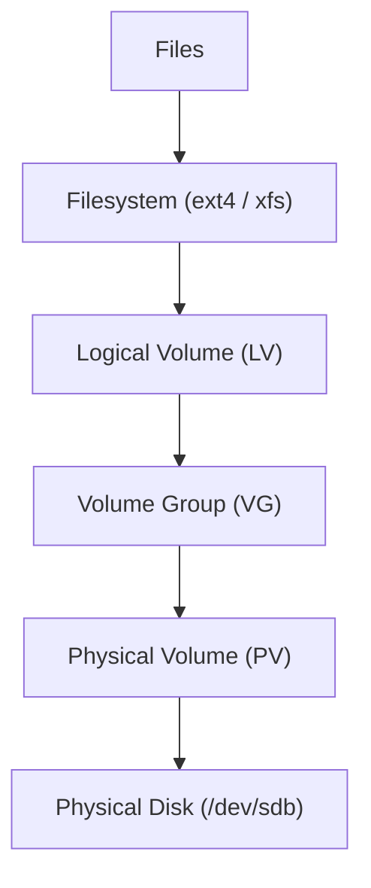

# LVM Engineering Handbook
**Project:** Atom-Bomb Storage Architecture
**Author:** Aniket Kumar
**Purpose:** Production-grade reference for creating, scaling, and troubleshooting Linux Logical Volume Manager (LVM) storage.

---

## Table of Contents
1. [What is LVM?](#1-what-is-lvm)
2. [Storage Hierarchy](#2-storage-hierarchy)
3. [Operational Flow](#3-operational-flow)
4. [Storage Container Model](#4-storage-container-model)
5. [Step-by-Step Implementation](#5-step-by-step-implementation)
6. [Persistent Mount](#6-persistent-mount)
7. [Expanding Storage](#7-expanding-storage)
8. [Adding Additional Disks](#8-adding-additional-disks)
9. [LVM Snapshots](#9-lvm-snapshots)
10. [LVM Internals](#10-lvm-internals)
11. [LVM Metadata](#11-lvm-metadata)
12. [IO Path](#12-io-path)
13. [Common Observations](#13-common-observations)
14. [Troubleshooting Commands](#14-troubleshooting-commands)
15. [Recovery Scenario](#15-recovery-scenario)
16. [Engineer Cheat Sheet](#16-engineer-cheat-sheet)
17. [XFS-Specific Troubleshooting](#17-xfs-specific-troubleshooting)

---

## 1. What is LVM?

**Logical Volume Manager (LVM)** is a storage virtualization layer in Linux that allows flexible disk management. 

Instead of binding filesystems directly to disks, LVM introduces a logical abstraction layer that enables:
- **Dynamic storage expansion**: Resize volumes on the fly.
- **Disk pooling**: Aggregate multiple disks into a single large pool.
- **Snapshot backups**: Create point-in-time copies of data.
- **Multi-disk aggregation**: Stripe or mirror data across multiple physical drives.

---

## 2. Storage Hierarchy

LVM works as a layered storage stack, moving from physical hardware to logical files.



---

## 3. Operational Flow

Typical workflow when adding new storage to a system:

1.  **Add Disk**
2.  **Identify Disk** (`lsblk`)
3.  **Create Physical Volume** (`pvcreate`)
4.  **Create Volume Group** (`vgcreate`)
5.  **Create Logical Volume** (`lvcreate`)
6.  **Create Filesystem** (`mkfs`)
7.  **Mount Filesystem** (`mount`)
8.  **Persist Mount** (edit `/etc/fstab`)

---

## 4. Storage Container Model (Venn Concept)

```text
+----------------------------------------------------+
|                    Volume Group (VG)               |
|                                                    |
|   +--------------------------------------------+   |
|   |              Logical Volume (LV)           |   |
|   |                                            |   |
|   |   +------------------------------------+   |   |
|   |   |            Filesystem              |   |   |
|   |   |            (ext4/xfs)              |   |   |
|   |   |                                    |   |   |
|   |   |               FILES                |   |   |
|   |   |                                    |   |   |
|   |   +------------------------------------+   |   |
|   |                                            |   |
|   +--------------------------------------------+   |
|                                                    |
|  PV1 (/dev/sdb)      PV2 (/dev/sdc)                |
|                                                    |
+----------------------------------------------------+
```

> **Think of it like:** Disk → Storage Pool → Virtual Partition → Filesystem → Files

---

## 5. Step-by-Step Implementation

### Step 1: Identify Disks
Check for newly attached storage devices.
```bash
sudo lsblk
```

**Example output:**
```text
NAME    MAJ:MIN RM SIZE RO TYPE MOUNTPOINT
sda       8:0    0  20G  0 disk
├─sda1    8:1    0 19.9G 0 part /
sdb       8:16   0  10G  0 disk
```

**Interpretation:**
| Device | Meaning |
| :--- | :--- |
| `sda` | OS disk |
| `sda1` | Root filesystem |
| `sdb` | New disk for LVM |

### Step 2: Create Physical Volume
Initialize the disk for LVM use.
```bash
sudo pvcreate /dev/sdb
```
*Output: Physical volume "/dev/sdb" successfully created.*

**Verify:**
```bash
sudo pvs
```
| PV | VG | Fmt | Attr | PSize | PFree |
| :--- | :--- | :--- | :--- | :--- | :--- |
| `/dev/sdb` | | lvm2 | --- | 10.00g | 10.00g |

### Step 3: Create Volume Group
Group physical volumes into a pool named `atom-bomb`.
```bash
sudo vgcreate atom-bomb /dev/sdb
```
*Output: Volume group "atom-bomb" successfully created.*

**Verify:**
```bash
sudo vgs
```
| VG | #PV | #LV | #SN | Attr | VSize | VFree |
| :--- | :--- | :--- | :--- | :--- | :--- | :--- |
| `atom-bomb` | 1 | 0 | 0 | wz--n- | 10.00g | 10.00g |

### Step 4: Create Logical Volume
Carve a 5GB volume named `molecules` from the pool.
```bash
sudo lvcreate -L 5G -n molecules atom-bomb
```

**Verify:**
```bash
sudo lvs
```
| LV | VG | Attr | LSize |
| :--- | :--- | :--- | :--- |
| `molecules` | `atom-bomb` | -wi-a----- | 5.00g |

**Device Paths:**
- `/dev/atom-bomb/molecules`
- `/dev/mapper/atom--bomb-molecules`

### Step 5: Create Filesystem
Format the logical volume with a filesystem (ext4 in this example).
```bash
sudo mkfs.ext4 /dev/atom-bomb/molecules
```

### Step 6: Mount Filesystem
Create a mount point and attach the volume.
```bash
sudo mkdir -p /mnt/physics_lab
sudo mount /dev/atom-bomb/molecules /mnt/physics_lab
```

**Verify:**
```bash
df -h
```
```text
Filesystem                       Size Used Avail Use% Mounted on
/dev/atom-bomb/molecules         4.9G   24K  4.6G   1% /mnt/physics_lab
```

---

## 6. Persistent Mount

### Find UUID
Logical Volumes should be mounted via UUID in `fstab` to ensure stability.
```bash
sudo blkid /dev/atom-bomb/molecules
```
*Example: `/dev/atom-bomb/molecules: UUID="7fad0a5a-f28b-4583-8f99-d9e9d1f43ab1"`*

### Edit fstab
```bash
sudo nano /etc/fstab
```
Add the following line:
```text
UUID=7fad0a5a-f28b-4583-8f99-d9e9d1f43ab1  /mnt/physics_lab  ext4  defaults  0 2
```

### Validate
Test the fstab entry without rebooting.
```bash
sudo mount -a
```

---

## 7. Expanding Storage

> **When to use**: After adding a disk to the VG (Section 8), or after expanding a cloud/VM disk from the hypervisor side.

### Filesystem Resizing Quick Reference

| Filesystem | Auto Tool (`-r` flag) | Manual Tool | Manual Target | Online? | Shrinkable? |
| :--- | :--- | :--- | :--- | :--- | :--- |
| **ext4** | `resize2fs` | `resize2fs` | Device Path (`/dev/...`) | Yes | Yes (Offline) |
| **XFS** | `xfs_growfs` | `xfs_growfs` | **Mount Point** (`/mnt/...`) | Yes | **NO** |

---

### Scenario A: Expanding a Separate Data LV

This is the **routine case** — a non-root volume like `/mnt/physics_lab` that holds application data.

**Recommended (auto-resize):**
```bash
# Extends LV and resizes filesystem in one step
sudo lvextend -r -l +100%FREE /dev/atom-bomb/molecules
```

**Manual (ext4):**
```bash
sudo lvextend -L +5G /dev/atom-bomb/molecules    # Step 1: Grow the LV
sudo resize2fs /dev/atom-bomb/molecules          # Step 2: Grow the FS (takes device path)
df -h /mnt/physics_lab                          # Step 3: Verify
```

**Manual (XFS):**
```bash
sudo lvextend -L +5G /dev/atom-bomb/molecules    # Step 1: Grow the LV
sudo xfs_growfs /mnt/physics_lab                 # Step 2: Grow the FS (takes MOUNT POINT)
df -h /mnt/physics_lab                          # Step 3: Verify
```

---

### Scenario B: Expanding the Root Filesystem (`/`)

This is the **special case** — common on cloud VMs (AWS, GCP, Azure) when you resize the OS disk. The root filesystem is always mounted, but LVM still allows **live, online growth** without a reboot.

**When does this happen?**
- You resized the cloud VM boot disk (e.g., 20GB → 50GB)
- You extended the root VG with a new PV and want `/` to grow

**Steps (XFS root — RHEL 9 default):**
```bash
# Check current state
df -h /
sudo lvs

# Option 1: Auto-resize (recommended)
sudo lvextend -r -L +10G /dev/rhel/root

# Option 2: Manual
sudo lvextend -L +10G /dev/rhel/root
sudo xfs_growfs /                  # Target is the mount point, which is /

# Verify
df -h /
```

**Steps (ext4 root):**
```bash
sudo lvextend -L +10G /dev/rhel/root
sudo resize2fs /dev/rhel/root      # Target is the device path
df -h /
```

> **Key difference vs. Scenario A**: The target of `xfs_growfs` is `/` (the root mount point), not `/mnt/something`. Everything else is identical.
## 8. Adding Additional Disks

1. **Create new PV:**
   ```bash
   sudo pvcreate /dev/sdc
   ```
2. **Extend VG:**
   ```bash
   sudo vgextend atom-bomb /dev/sdc
   ```
Now, the `atom-bomb` VG capacity includes both `sdb` and `sdc`.

---

## 9. LVM Snapshots

### Create Snapshot
Snapshots allow you to capture the state of a volume.
```bash
sudo lvcreate -L 1G -s -n molecules-snap /dev/atom-bomb/molecules
```

### Mount Snapshot
```bash
sudo mkdir /mnt/snapshot
sudo mount /dev/atom-bomb/molecules-snap /mnt/snapshot
```
> **Note:** Snapshots use **Copy-on-Write (CoW)**. Only changed blocks are stored in the snapshot volume.

---

## 10. LVM Internals: Extents

LVM divides disks into chunks called **Extents**.

- **Physical Extent (PE)**: Storage chunk inside a physical volume.
- **Logical Extent (LE)**: Storage chunk assigned to logical volumes.
- **Default Size**: 4MB (can be configured during VG creation).

**Mapping Example:**
- `LV molecules LE0` → `/dev/sdb PE0`
- `LV molecules LE1` → `/dev/sdb PE1`
- `LV molecules LE2` → `/dev/sdc PE50`

---

## 11. LVM Metadata

LVM metadata is critical for volume recovery and management.

### On-Disk Metadata
Stored in the PV header. Inspect with:
```bash
sudo pvdisplay -m
```

### Backup Metadata
Metadata is automatically backed up, but can be manually triggered:
```bash
sudo vgcfgbackup
```

### In-Kernel (Device Mapper)
LVM uses the kernel's **Device Mapper** to create virtual block devices.
```bash
sudo dmsetup ls
```

---

## 12. IO Path

**Application Level:**
```text
Application → Filesystem → Logical Volume → Device Mapper → Physical Disk
```

**Kernel Path:**
1. `write()` syscall
2. **VFS** (Virtual File System)
3. **Filesystem** (ext4/xfs)
4. **Block Layer**
5. **Device Mapper** (LVM Logic)
6. **Physical Disk Driver**

---

## 13. Common Observations

### Double Dash in Device Names
Device Mapper nodes replace single dashes with double dashes to avoid ambiguity.
- Volume: `atom-bomb` → Mapper: `atom--bomb`

### Capacity Discrepancy (5GB → 4.9GB)
Users often see less space than allocated due to:
- Filesystem overhead
- Journaling requirements
- Binary (GiB) vs. Decimal (GB) unit conversions.

### CRITICAL: XFS Shrinking
Unlike ext4, **XFS filesystems cannot be shrunk.** 
- **Action**: Always grow XFS in small increments.
- **Recovery**: If you over-allocate an XFS volume, the only way to "shrink" it is to back up the data, destroy the LV, recreate a smaller one, and restore the data.

---

## 14. Troubleshooting Commands

| Command | Description |
| :--- | :--- |
| `sudo pvs` / `pvdisplay` | Check Physical Volumes |
| `sudo vgs` / `vgdisplay` | Check Volume Groups |
| `sudo lvs` / `lvdisplay` | Check Logical Volumes |
| `lsblk -f` | View filesystems and UUIDs |

---

## 15. Recovery Scenario

If volumes are not active (e.g., after a disk migration):
```bash
sudo vgscan
sudo vgchange -ay
sudo lvscan
```

---

## 16. Engineer Cheat Sheet

```bash
# Workflow Summary
sudo lsblk                                      # 1. Identify
sudo pvcreate /dev/sdb                          # 2. PV
sudo vgcreate atom-bomb /dev/sdb                # 3. VG
sudo lvcreate -L 5G -n molecules atom-bomb      # 4. LV
sudo mkfs.xfs /dev/atom-bomb/molecules          # 5. Format (XFS recommended)
sudo mkdir -p /mnt/physics_lab                  # 6. Mount Prep
sudo mount /dev/atom-bomb/molecules /mnt/lab    # 7. Mount
sudo blkid                                      # 8. Get UUID

# Expansion Shortcut
sudo lvextend -r -L +10G /dev/atom-bomb/molecules  # Extend LV + Filesystem
sudo xfs_growfs /mnt/physics_lab                   # Manual XFS grow (data LV)
sudo xfs_growfs /                                  # Manual XFS grow (root FS)
```

---

## 17. XFS-Specific Troubleshooting

> **Note:** `xfs_growfs` requires the filesystem to be **mounted**. These errors occur after running `lvextend` but before (or incorrectly running) `xfs_growfs`.

| Error Message | Root Cause | Fix |
| :--- | :--- | :--- |
| `data size unchanged, skipping` | Filesystem already fills the device; block device was not expanded | Expand the block device first with `lvextend`, then re-run `xfs_growfs` |
| `is not a mounted XFS filesystem` | `xfs_growfs` was given a device path instead of a mount point, or the FS is not mounted | Ensure the volume is mounted; use the **mount point** as the argument |
| Growing fails with I/O errors | Underlying storage has hardware errors | Check logs with `sudo dmesg \| tail -20` and disk health with `sudo smartctl -a /dev/sdb` |

**Diagnostic commands:**
```bash
sudo dmesg | tail -20          # Kernel error log
sudo smartctl -a /dev/sdb     # Disk SMART health
xfs_info /mnt/physics_lab     # Current XFS metadata and block counts
df -Th /mnt/physics_lab       # Filesystem type + size
```
